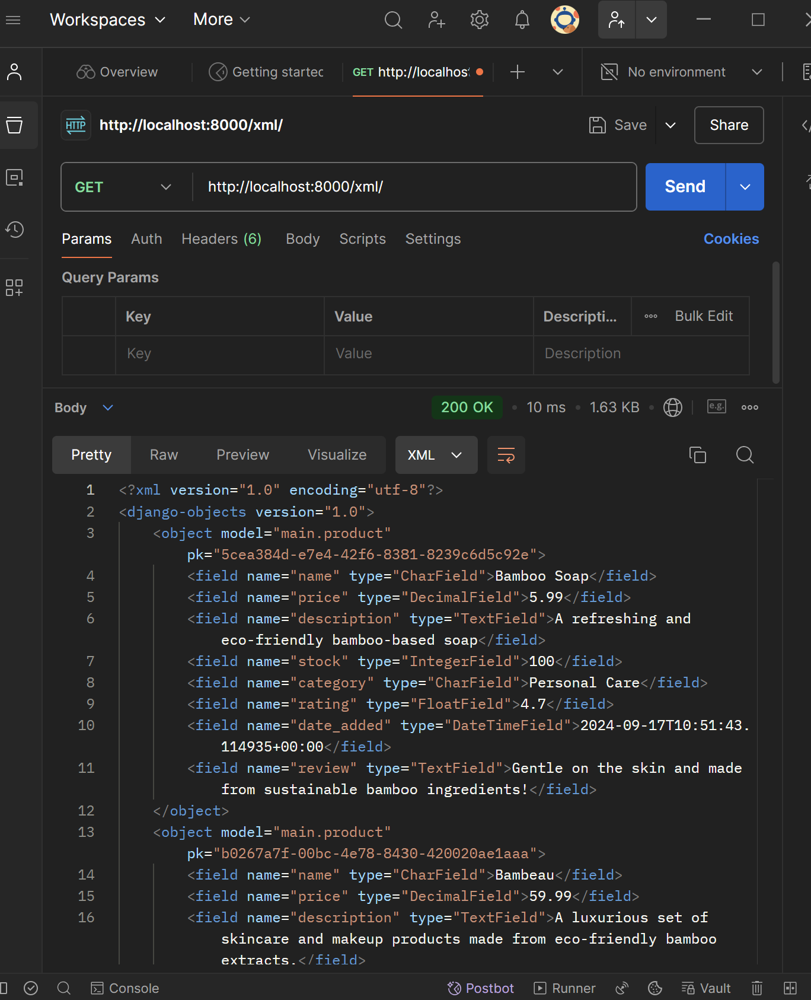

TUGAS INDIVIDU PBP
Nama: Regina Meilani Aruan
NPM: 2306275632

# TUGAS 2

## 1.  Jelaskan bagaimana cara kamu mengimplementasikan checklist di atas secara step-by-step?

Pertama-tama, saya membuat direktori bernama e-commerce, kemudian menginstal semua dependencies yang diperlukan, termasuk Django. Selanjutnya, saya menjalankan perintah django-admin startproject main untuk memulai proyek Django baru dengan nama main.

Kedua, untuk menambahkan aplikasi dengan nama main ke dalam proyek e-commerce, saya menggunakan perintah python manage.py startapp main. Perintah ini membuat sebuah folder main dengan struktur dasar aplikasi Django yang diperlukan. 

Ketiga, agar aplikasi main dapat diakses, saya membuat file urls.py di dalam direktori main dan menambahkan routing yang diperlukan. Ini memastikan bahwa URL yang dikunjungi pengguna diarahkan ke tampilan yang sesuai dalam aplikasi main.

Keempat, di dalam main/models.py, saya mendefinisikan model Product dengan atribut yang relevan untuk aplikasi mainnya BambooShop. Model Product memiliki atribut sebagai berikut:
- name (nama produk) dengan tipe data CharField yang dapat menyimpan hingga 255 karakter
- price (harga produk) dengan tipe data DecimalField yang dapat menyimpan angka desimal dengan hingga 10 digit dan 2 angka di belakang koma
- description (deskripsi produk) dengan tipe data TextField untuk deskripsi produk yang lebih panjang.
- stock (jumlah stok) dengan tipe data IntegerField, default 0.
- category (kategori produk) dengan tipe data CharField yang memiliki panjang maksimum 100 karakter.
- rating (penilaian produk) dengan tipe data FloatField, default 0.
- date_added (tanggal ditambahkan) dengan tipe data DateTimeField yang otomatis mengisi tanggal dan waktu saat produk ditambahkan.
- review (ulasan produk) dengan tipe data TextField, yang dapat kosong atau null.
Setelah mendefinisikan model, saya menjalankan migrasi untuk memperbarui database dengan struktur tabel baru.

Kelima, di file views.py, saya membuat fungsi show_main yang menangani request dan mengembalikan template HTML bernama main.html. Fungsi ini menyertakan data produk dalam konteks yang akan ditampilkan pada template. Contoh data produk mencakup atribut seperti nama, harga, deskripsi, stok, kategori, penilaian, tanggal ditambahkan, dan ulasan.

Keenam, di main/urls.py, saya menambahkan routing untuk memetakan fungsi show_main yang telah dibuat di views.py. Ini menentukan URL yang diakses pengguna dan menghubungkannya dengan tampilan yang sesuai.

Ketiga, untuk membuat aplikasi BambooShop dapat diakses secara online, saya mengakses halaman PWS, mendaftar jika belum memiliki akun, lalu membuat proyek baru. Di file settings.py proyek Django, saya menambahkan URL deployment PWS ke dalam ALLOWED_HOSTS. Kemudian, saya mengisi credentials yang diberikan untuk menyelesaikan proses deployment dan memastikan aplikasi BambooShop dapat diakses oleh teman-teman melalui Internet.

## 2. Buatlah bagan yang berisi request client ke web aplikasi berbasis Django beserta responnya dan jelaskan pada bagan tersebut kaitan antara urls.py, views.py, models.py, dan berkas html.

Client Request ->  URL Routing (urls.py) -> View Function (views.py) -> Model (models.py) -> Database -> HTML Template -> Client Response

Pada bagan alur request dan response di aplikasi Django, urls.py berfungsi sebagai pengatur rute, menentukan bagaimana URL yang diminta oleh client dipetakan ke fungsi view yang tepat di views.py. Fungsi view tersebut memproses request dan, jika diperlukan, berinteraksi dengan models.py untuk mengambil atau memanipulasi data dari database. Setelah data diproses, fungsi view mengirimkan data tersebut ke berkas HTML Template untuk dirender menjadi format yang dapat ditampilkan di browser. HTML Template ini kemudian dipergunakan untuk menyusun respons akhir yang dikirim kembali ke client.

## 3. Jelaskan fungsi git dalam pengembangan perangkat lunak!

Git adalah alat penting dalam pengembangan perangkat lunak karena ia mengelola versi kode dengan efisien. Dengan Git, pengembang dapat melacak perubahan kode secara rinci, yang membantu mereka memahami bagaimana dan kapan kode berubah seiring waktu. Git memudahkan kolaborasi dengan memungkinkan beberapa pengembang bekerja pada proyek yang sama secara bersamaan melalui sistem branching dan merging. Ini juga memungkinkan rollback atau pengembalian ke versi sebelumnya jika terjadi kesalahan, serta menyediakan sistem yang transparan untuk mengelola dan mengintegrasikan perubahan dari berbagai kontributor.

## 4. Menurut Anda, dari semua framework yang ada, mengapa framework Django dijadikan permulaan pembelajaran pengembangan perangkat lunak?

Django sering dijadikan pilihan untuk pembelajaran awal karena kemudahan penggunaannya dan struktur yang jelas. Framework ini mengintegrasikan berbagai fitur penting secara default, seperti otentikasi dan manajemen basis data, yang memungkinkan pemula fokus pada logika aplikasi daripada harus membangun dari nol. Dokumentasinya yang lengkap dan komunitas yang aktif mempermudah proses belajar, sementara struktur arsitektur Model-View-Template (MVT) membantu pemula memahami bagaimana aplikasi web bekerja secara sistematis.

## 5. Mengapa model pada Django disebut sebagai ORM?

Model pada Django disebut sebagai ORM atau Object-Relational Mapping karena menghubungkan objek Python dengan tabel-tabel di database. ORM memungkinkan pengembang untuk berinteraksi dengan data menggunakan sintaks Python yang familiar, daripada menulis query SQL yang rumit. Ini membuat pengelolaan data lebih intuitif dan terintegrasi langsung dengan kode aplikasi, memungkinkan pengembang untuk menangani data sebagai objek dan mengelola hubungan antar data dengan cara yang lebih alami dan mudah dipahami.

# TUGAS 3

## 1.  Jelaskan mengapa kita memerlukan *data delivery* dalam pengimplementasian sebuah platform?

*Data delivery* sangat penting dalam pengimplementasian platform karena dapat memungkinkan pertukaran data antar bagian sistem yang berbeda, misal dari satu stack ke stack lainnya. XML dan JSON adalah dua format data yang umum digunakan untuk mentransfer informasi antara aplikasi web atau layanan web. Dalam sebuah aplikasi, *front-end* sering kali membutuhkan data dari *back-end* (server) untuk menampilkan informasi dan memproses permintaan user.  Dengan adanya implementasi *data delivery*, seperti menggunakan format XML atau JSON, komunikasi ini menjadi lebih mudah dan teratur.

## 2.  Menurutmu, mana yang lebih baik antara XML dan JSON? Mengapa JSON lebih populer dibandingkan XML?

JSON lebih populer dibandingkan dengan XML karena secara struktur lebih sederhana dan mudah digunakan, terutama untuk aplikasi modern. JSON dirancang untuk pertukaran data dengan format yang lebih ringkas, sehingga lebih cepat diproses dan dikirim. Hal ini membuat komunikasi antar sistem menjadi lebih efisien, terutama untuk API dan aplikasi seluler yang membutuhkan kecepatan.

Struktur JSON terdiri dari pasangan *key-value*, yang mirip dengan objek dalam pemrograman. Setiap *key* berfungsi sebagai nama atau kunci, sedangkan *value* adalah nilai yang terkait dengan kunci tersebut. Format ini memungkinkan data disimpan dan diakses dengan lebih mudah.

Berbeda dengan XML yang lebih rumit dan sering digunakan untuk menyimpan data kompleks, JSON lebih fokus pada pertukaran data yang cepat dan ringan. Selain itu, JSON lebih mudah dibaca oleh manusia dan langsung dapat digunakan di JavaScript tanpa memerlukan alat tambahan, yang membuatnya lebih praktis untuk aplikasi web masa kini. Jadi, jika tujuan utamanya adalah performa dan kecepatan, JSON umumnya menjadi pilihan yang lebih tepat.

## 3. Jelaskan fungsi dari method `is_valid()` pada form Django dan mengapa kita membutuhkan method tersebut?

Method `is_valid()` pada Form Django digunakan untuk memvalidasi data input yang diterima dari user. Fungsinya adalah memastikan bahwa data yang dimasukkan sudah sesuai dengan aturan validasi yang ditentukan dalam form tersebut. Jika data valid, method ini akan mengembalikan *True*, sehingga form dapat diproses untuk menyimpan data ke database. Namun, jika data tidak valid, `is_valid()` akan mengembalikan *False* dan Django akan menampilkan pesan kesalahan kepada user.

Proses validasi ini terjadi saat data difilter dan dibersihkan. Ada tiga metode pembersihan (*cleaning*) yang berjalan selama validasi, biasanya dijalankan ketika `is_valid()` dipanggil. Proses ini memastikan data memenuhi semua aturan yang ditetapkan. Jika diperlukan penyesuaian pengolahan, perubahan dapat dilakukan pada berbagai metode tersebut, tergantung pada tujuan validasi yang ingin dicapai. (Django Documentation)

## 4. Mengapa kita membutuhkan csrf_token saat membuat form di Django? Apa yang dapat terjadi jika kita tidak menambahkan csrf_token pada form Django? Bagaimana hal tersebut dapat dimanfaatkan oleh penyerang?

CSRF token diperlukan untuk melindungi aplikasi dari serangan Cross-Site Request Forgery (CSRF). Setiap kali halaman dengan form muncul, Django secara otomatis menghasilkan token acak (random string) yang disisipkan ke dalam form. Ketika form tersebut dikirim, token ini ikut terkirim ke server, dan di server, token tersebut akan diperiksa untuk memastikan bahwa permintaan itu benar-benar berasal dari pengguna yang sah, bukan dari penyerang.

Jika kita tidak menambahkan CSRF token, aplikasi kita akan menjadi rentan terhadap serangan CSRF. Dengan CSRF token, permintaan ini bisa dicegah karena server akan mendeteksi bahwa token yang dikirim tidak valid atau tidak ada, sehingga permintaan akan ditolak. (Django Documentation)

## 5.  Jelaskan bagaimana cara kamu mengimplementasikan checklist di atas secara step-by-step (bukan hanya sekadar mengikuti tutorial).

Pertama-tama, saya membuat form input di dalam file `views.py`. Di sini, saya memastikan form tersebut terhubung ke model yang menggunakan UUID. Saya mengimpor form dari `forms.py` dan membuat fungsi `create_product_entry` di `views.py`. Fungsi ini menangani permintaan POST untuk menyimpan data produk yang baru dimasukkan.

Langkah berikutnya adalah membuat file `create_product_entry.html` di dalam folder main/templates. Saya menggunakan template dasar dari `base.html` (skeleton) yang sudah dibuat sebelumnya. Dengan ini, form input dapat terstruktur dengan baik. Di halaman ini, saya menggunakan block content untuk mengisi form produk bambooshop.

Saya memastikan bahwa UUID digunakan di dalam model produk untuk setiap entri baru yang ditambahkan. UUID berguna untuk memberikan ID unik pada setiap produk, memastikan tidak ada bentrok ID saat data produk bertambah.

Setelah form selesai, saya menambahkan 4 fungsi views baru untuk melihat data yang sudah dimasukkan. View pertama dan kedua berfungsi untuk menampilkan data dalam format XML dan JSON. View ketiga dan keempat memungkinkan melihat data spesifik berdasarkan ID dalam format XML dan JSON.

Langkah berikutnya adalah menambahkan routing di file urls.py. Saya membuat URL yang terhubung ke setiap view yang sudah dibuat sebelumnya, sehingga masing-masing format dan view (baik yang menampilkan semua data atau berdasarkan ID) bisa diakses melalui URL yang berbeda.

Setelah semua routing dan view sudah siap, saya menggunakan Postman untuk menguji setiap URL yang menampilkan data dalam format XML dan JSON.  Tak lupa, saya melakukan add-commit-push ke GitHub E-commerce saya. Untuk deploy PWS. saya sedikit terhambat karena masih ada error atau failed terus menerus. Saya telah menyertakan bukti screenshot hasil dari Postman sebagai dokumentasi bukti pengujian.

